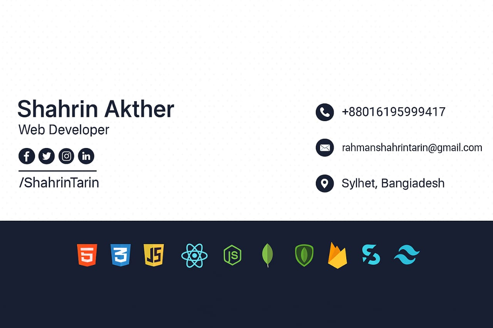

### Hi there 👋, I'm 
<h1>Shahrin Akther</h1>
<h3>Web Developer</h3>  
 

  

<h3 align="center">A passionate Fullstack developer ( MERN ) from Sylhet, Bangladesh</h3>
   
  
Assalamu Alaikum , I am Shahrin Akther, a dedicated and enthusiastic React front-end developer with knowledge of full-stack development. Over the past 9 month, I have been honing my skills in MERN Stack web development, specializing in React.js for front-end development.
  
 

- 🌱 I’m currently learning *ThreeJs*

- 📫 How to reach me *rahmanshahrintarin@gmail.com*

 

## 🌐 Socials:

<h3 align="left">Connect with me:</h3>

<h3 align="left">Languages and Tools:</h3>

          

# 📊 GitHub Stats:
 
 

---

<!-- Proudly created with GPRM ( https://gprm.itsvg.in ) -->