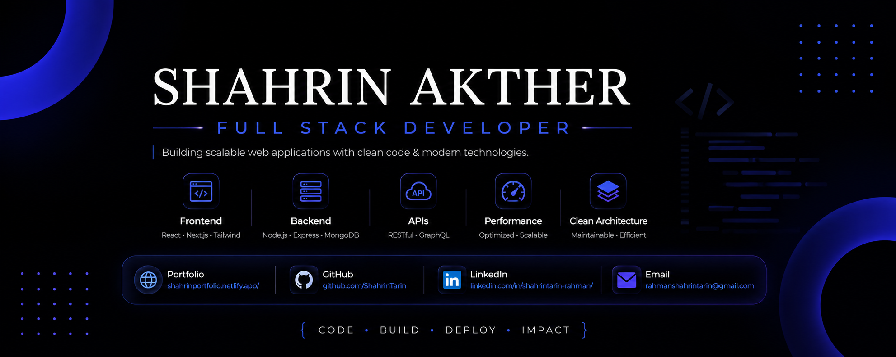

<div align="center">



</div>

<br/>

<div align="center">

[](https://github.com/ShahrinTarin)

</div>

<div align="center">

[](https://github.com/ShahrinTarin)
[](https://github.com/ShahrinTarin)
[](https://www.linkedin.com/in/shahrintarin-rahman)
[](https://shahrinportfolio.netlify.app/)

</div>

---

## 〔 `whoami` 〕

```typescript
const shahrin = {
  name:      "Shahrin Akther",
  title:     "Full Stack Developer",
  location:  "Sylhet, Bangladesh 🇧🇩",
  greeting:  "Assalamu Alaikum 👋",

  stack: {
    frontend:  ["Next.js", "React", "TypeScript", "Tailwind CSS"],
    backend:   ["Node.js", "Express", "REST APIs", "GraphQL"],
    database:  ["PostgreSQL", "Drizzle ORM", "MongoDB"],
    devops:    ["Docker", "GitHub Actions", "CI/CD"],
    tools:     ["Figma", "Postman", "Firebase", "Git"],
  },

  currentlyLearning: ["Three.js", "System Design", "Cloud Infra"],
  openTo: ["Full-time roles", "Freelance", "Open Source"],
  contact: "rahmanshahrintarin@gmail.com",
} satisfies Developer;
```

---

## 〔 Tech Arsenal 〕

**⬡ Frontend**


**⬡ Backend & Database**


**⬡ DevOps & Infrastructure**


**⬡ Auth & Design**


---

## 〔 Featured Projects 〕

<br/>

### 🔷 [VisionMart](https://vision-mart.vercel.app/) — AI-Powered E-Commerce Platform

> An intelligent shopping platform where admins can generate product images using AI, making product listing faster and smarter.

**Stack:** `Next.js` `TypeScript` `NextAuth` `Mongoose` `Node.js` `Express.js` `PNPM`

| Feature | Detail |
|---|---|
| 🔍 Discovery | Advanced search with category filters |
| 🤖 AI Integration | Admin-side AI image generation for products |
| 🛡️ Auth | Secure NextAuth authentication & authorization |
| 📦 Admin | Full dashboard with order management system |

[](https://vision-mart.vercel.app/)
[](https://github.com/abdullahalsuad/vision-mart)

---

### 🔷 [FitFolio](https://fitfolio-by-shahrin.web.app/) — Fitness Trainer Booking Platform

> A full-featured platform connecting fitness enthusiasts with professional trainers — book classes, manage schedules, and pay securely.

**Stack:** `React` `JavaScript` `Firebase` `Node.js` `MongoDB` `Express.js` `JWT` `Stripe API`

| Feature | Detail |
|---|---|
| 👥 Roles | Separate dashboards for Users, Trainers & Admins |
| 💳 Payments | Real-time Stripe payment + booking confirmation |
| 📊 Analytics | Revenue, transactions & user growth tracking |
| 🛡️ Security | JWT-secured routes and role-based permissions |

[](https://fitfolio-by-shahrin.web.app/)
[](https://github.com/ShahrinTarin/FitFolio)

---

### 🔷 [MathMatter](https://mathmatter-by-shahrin-tarin.web.app/) — Interactive Math Learning App

> An interactive platform that makes learning mathematics engaging through practice tools, problem sets, and progress tracking.

**Stack:** `React` `JavaScript` `Firebase` `MongoDB` `Node.js` `Express.js` `React Router` `JWT`

| Feature | Detail |
|---|---|
| 🔎 Filtering | Filter blogs by category or title via query params |
| 📝 CRUD | Add, edit, delete & comment with real-time updates |
| 🏆 Discovery | Rank blogs by description length |
| ✨ UX | Motion animations and interactive tooltips |

[](https://mathmatter-by-shahrin-tarin.web.app/)
[](https://github.com/ShahrinTarin/mathematter)

---

### 🔷 [StoveStories](https://stovestories-1a7e6.web.app/) — Community Recipe Sharing Platform

> A vibrant recipe book platform where food lovers share, explore, and save recipes — connecting communities through cooking stories.

**Stack:** `React` `JavaScript` `Firebase` `MongoDB` `Node.js` `Express.js` `React Router`

| Feature | Detail |
|---|---|
| 🍳 UGC | User-generated recipes with images, times & categories |
| ❤️ Interaction | Like, edit, delete recipes with real-time updates |
| 📚 Collections | Personalized recipe collections filtered by user |
| ✨ UX | Tooltips and smooth animations throughout |

[](https://stovestories-1a7e6.web.app/)
[](https://github.com/ShahrinTarin/StoveStore)

---

## 〔 GitHub Stats 〕

<div align="center">

<!-- Stats + Languages: using stats.quine.sh as reliable alternative -->


</div>

<div align="center">

<!-- Streak: nirzak is a reliable fork -->


</div>

<div align="center">

<!-- Trophies: proven working -->
[](https://github.com/ryo-ma/github-profile-trophy)

</div>

> ⚠️ **Note for you:** If the stats cards still show broken after pushing to GitHub, go to [github-readme-stats.vercel.app](https://github-readme-stats.vercel.app) and deploy your **own free instance** on Vercel — it takes 2 minutes and will never rate-limit you again. Instructions: [anuraghazra/github-readme-stats](https://github.com/anuraghazra/github-readme-stats#deploy-on-your-own-vercel-instance)

---

## 〔 Connect 〕

<div align="center">

| | Platform | Link |
|---|---|---|
| 🌐 | **Portfolio** | [shahrinportfolio.netlify.app](https://shahrinportfolio.netlify.app/) |
| 💼 | **LinkedIn** | [in/shahrintarin-rahman](https://www.linkedin.com/in/shahrintarin-rahman) |
| 🐙 | **GitHub** | [github.com/ShahrinTarin](https://github.com/ShahrinTarin) |
| 📧 | **Email** | [rahmanshahrintarin@gmail.com](mailto:rahmanshahrintarin@gmail.com) |
| 📘 | **Facebook** | [ShahrinTarin Rahman](https://facebook.com/ShahrinTarin) |

</div>

---

<div align="center">

```
{ CODE  •  BUILD  •  DEPLOY  •  IMPACT }
```

*Crafted with intention from Sylhet 🇧🇩 · Powered by caffeine · Deployed with Docker 🐳*

[](https://visitcount.itsvg.in)

</div>